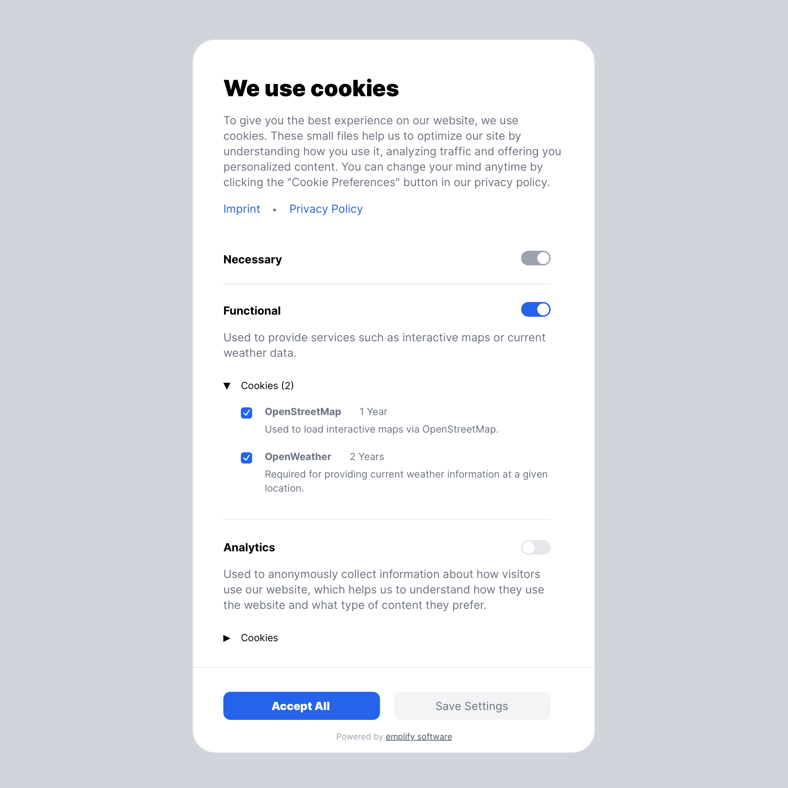

# Statamic Cookie Dialog

[](https://statamic.com)
[](https://statamic.com)

Manage cookie preferences in your Statamic projects with ease.




## Features

This addon provides a customizable cookie dialog that allows your users to accept or decline cookies based on your
defined cookie groups and individual cookies. You, on the other hand, show or block content dynamically based on the
user's cookie preferences.

✅ Cookie dialog with customizable content<br>
✅ Customizable cookie groups and cookies<br>
✅ Tag to render content dynamically based on cookie preferences<br>
✅ Tag to render fallback content if a given cookie is declined<br>
✅ Cookie versioning<br>
✅ JavaScript API<br>
✅ Multi-Site Support<br>

> [!NOTE]
> This addon does not guarantee GDPR compliance. Please consult with a legal expert to ensure that your website is
> compliant with the applicable data protection laws.

## 🛠️ How to Install

You can search for this addon in the `Tools > Addons` section of the Statamic control panel and click **install**, or
run the following command from your project root:

``` bash
composer require emplify-software/statamic-cookie-dialog
```

After the addon is installed, publish the cookie assets by running:

``` bash
php artisan vendor:publish --tag=statamic-cookie-dialog
```

## ⭐️ Pro Version

You can purchase the pro version of this addon on the [Statamic Marketplace](https://statamic.com/addons/emplify-software/cookie-dialog).

After purchasing the pro version, you can enable it by setting the edition of the addon to `'pro'` in the `config/statamic/editions.php` file of your project:

```php
    'addons' => [
        'emplify-software/statamic-cookie-dialog' => 'pro'
    ],
```

When the pro version is enabled, the [attribution link to emplify software GmbH](#-license) will be removed.

## 💡 How to Use

To enable the cookie dialog for all pages, put the following tag anywhere in your `layout.antlers.html` file:

```antlers
{{ cookie_dialog }}
```

> [!NOTE]
> If you have [Static Caching](https://statamic.dev/static-caching) enabled, make sure to wrap the
`{{ cookie_dialog }}`, `{{ cookie:allowed }}` and `{{ cookie:denied }}` tags in a `{{ nocache }}` tag to prevent the
> cookie dialog from being cached:
> ```antlers
> {{ nocache }}
>    {{ cookie_dialog }}
> {{ /nocache }}
> ```

This will render a popup dialog that will ask the user to accept or decline cookies.
A description text and an example cookie group is provided by default.

You have full control over the dialog content and all cookie settings in the control panel under
`Tools > Cookie Dialog`.


In the **"Cookies"** tab, you can enable or disable the cookie dialog, set the [cookie version](#-cookie-versioning),
and create or edit cookie groups.
Cookie groups have a unique identifier, name and description and can be marked as required and optionally be checked by
default.
Each cookie group can contain multiple cookies with a name, description and lifetime.

In the **"Content"** tab, you can customize the content of the cookie dialog, including the title, description, buttons
and the highlight color for the toggle switches.

### Enabling Content based on Cookie Preferences

You can wrap content in a `{{ cookie:allowed }}` tag to only show it if the user has accepted a specific cookie or
cookie group.

```antlers
{{ cookie:allowed cookies="marketingCookieA|marketingCookieB" }}
    <p>
        This content will only be shown if the user has accepted
        the cookies marketingCookieA and marketingCookieB
    </p>
{{ /cookie:allowed }}
```

You can also allow content based on one or multiple cookie groups:

```antlers
{{ cookie:allowed group="marketing" }}
    <p>
        This content will only be shown if the user has accepted 
        the cookie group "marketing"
    </p>
{{ /cookie:allowed }}
```

```antlers
{{ cookie:allowed group="marketing|statistics" }}
    <p>
        This content will only be shown if the user has accepted
        the cookie groups "marketing" and "statistics"
    </p>
{{ /cookie:allowed }}
```

Once the user has accepted the cookies, the content will be dynamically loaded without the need to reload the page.

This works with all types of content, including images, stylesheets, and scripts:

```antlers
{{ cookie:allowed cookies="marketingCookieA|marketingCookieB" }}
    <script src="https://example.com/marketing-script.js"></script>
{{ /cookie:allowed }}
```

### Enabling Fallback Content if Cookies Are Not (Yet) Accepted

You can wrap content in a `{{ cookie:denied }}` tag to only show it if the user has not accepted a specific cookie group
or cookie. This content will be displayed by default until the necessary cookies are accepted.

You can filter by cookies or groups in the same way as with the `{{ cookie:allowed }}` tag.

```antlers
{{ cookie:denied cookies="marketingCookieA|marketingCookieB" }}
    <p>
        Please enable the cookies marketingCookieA
        and marketingCookieB to see this content
    </p>
{{ /cookie:denied }}

{{ cookie:allowed cookies="marketingCookieA|marketingCookieB" }}
    <p>
        This content will only be shown if the user has accepted
        the cookies marketingCookieA and marketingCookieB
    </p>
{{ /cookie:allowed }}
```

The content inside the `{{ cookie:denied }}` tag will be dynamically removed once the user has accepted the cookies.


> [!IMPORTANT]
> When using the `{{ cookie:allowed }}` and `{{ cookie:denied }}` tags or the [JavaScript API](#-javascript-api), a
> cookie group is regarded as allowed only if *all* cookies in the group are accepted by the user.
>
> This is not to be confused with the toggle switches in the cookie dialog: When *any* of the individual cookie toggles
> in a group are selected, the group toggle is automatically activated to indicate to the user that they have accepted a
> cookie from this group, but the group is not considered allowed until all cookies in the group are accepted.

### Hiding the Cookie Dialog on Specific Pages

When you put the `{{ cookie_dialog }}` tag in your `layout.antlers.html` file, the dialog will be shown on all pages by default.
To hide the cookie dialog on specific pages (e.g. on the privacy policy page), you can set the `hidden` parameter depending on the page's URL or other conditions:

```antlers
{{ cookie_dialog :hidden="current_uri == '/privacy-policy'" }}
```

By using the `hidden` parameter, you can still show the cookie dialog on the page later using the [JavaScript API](#-javascript-api).
If you want to completely disable the cookie dialog on certain pages, you can wrap the `{{ cookie_dialog }}` tag in a conditional statement:

```antlers
{{ if current_uri != '/privacy-policy' }}
    {{ cookie_dialog }}
{{ /if }}
```

### Iterating over Cookie Groups and Cookies

You can iterate over all cookie groups and cookies in your cookie configuration using the `{{ cookie_groups }}` tag.
This can be useful if you want to display a table containing information about all the cookies used on your website (e.g. on a
dedicated privacy policy page):

```antlers
<table>

  <thead>
    <tr>
      <th>Name</th>
      <th>Description</th>
      <th>Lifetime</th>
    </tr>
  </thead>

  <tbody>
    {{ cookie_groups }}
      {{ cookies }}
        <tr>
          <td>{{ cookie_identifier }}</td>
          <td>{{ cookie_description }}</td>
          <td>{{ cookie_lifetime }}</td>
        </tr>
      {{ /cookies }}
    {{ /cookie_groups }}
  </tbody>

</table>
```

### 🌗 Automatic Dark Mode

The cookie dialog will automatically switch to a dark mode if the user's operating system is set to dark mode.
You can disable this feature in the control panel under `Tools > Cookie Dialog > Content > Automatic Dark Mode`.

To manually enable dark mode for the cookie dialog, just add the `es-dark` class to the html tag of your website:
```js
document.documentElement.classList.add('es-dark');
```


## 🧩 JavaScript API

This addon also provides a JavaScript API that allows you to interact with the cookie dialog and the cookie preferences.

The JavaScript API is accessible through the global `CookieDialog` object when a `{{ cookie_dialog }}` tag is present on
the page.

### Triggering the Cookie Dialog Manually

You can trigger the cookie dialog manually with JavaScript by calling the following global function:

```javascript
CookieDialog.showDialog()
```

This will open a non-blocking dialog that gives the user the option to change their cookie preferences.
Per default, the page will be reloaded after the user has saved their new cookie preferences to apply the changes to
content wrapped in `{{ cookie:allowed }}` or `{{ cookie:denied }}` tags.
If the user closes the dialog without saving, if there are no changes to the cookie preferences, or if the
content can be dynamically injected without a page reload, the page will not be reloaded.

You can explicitly override this default reload behaviour:

* To prevent the page from reloading, pass `false` as a parameter.
* To force reload the page when the cookie preferences have changed, pass `true` as a parameter

```javascript
CookieDialog.showDialog(false) // Prevent page reload after saving cookie preferences
```

We recommend putting a button or link on your website that allows the user to change their cookie
preferences at any time. This can be done by calling `CookieDialog.showDialog()` when the button is clicked:

```html

<button onclick="CookieDialog.showDialog()">Change Cookie Preferences</button>
```

### Accessing the Cookie Preferences

You can access the user's cookie preferences as stored in the browser cookie via `CookieDialog.cookiePreferences`.
This object contains the version, timestamp, and all accepted cookies grouped by cookie group, e.g.:

```json
{
    "version": "1",
    "timestamp": 1724072915147,
    "cookies": {
        "marketing": {
            "marketingCookieA": true,
            "marketingCookieB": true
        },
        "statistics": {
            "statisticsCookieA": true,
            "statisticsCookieB": false
        }
    }
}
```

The cookie preferences object conforms to the following TypeScript interface:

```typescript
interface CookiePreferences {
    version: string;
    timestamp: number;
    cookies: {
        [cookieGroup: string]: {
            [cookieName: string]: boolean;
        };
    };
}
```

You can also get a list of all currently accepted cookies with `CookieDialog.allowedCookies` (`string[]`) and a list of
all currently accepted cookie groups with `CookieDialog.allowedGroups` (`string[]`).

## 🔢 Cookie Versioning

You can set a cookie version in the cookie settings (under `Tools > Cookie Dialog`). This version will be stored in the
visitor's browser cookies and will be checked against the current version in the cookie settings.
When the version is updated, the cookie dialog will be shown again to all users, even if they have already accepted
the cookies.

## 🔐 Access Control (Permissions)

If you want to allow only certain users to access the cookie dialog settings in the control panel, make sure to set the
`manage cookie dialog` permission for a user's role. You may also manage this permission under the "Permissions" section
in the control panel.

## 🌐 Translations

You can customize the translations of the cookie dialog by creating a new language file in the `resources/lang`
directory of your Statamic project.
The language file should be named `[lang].json`, where `[lang]` is the language code of the translation (e.g. `en` for
English or `de` for German).

In the translation file, you can define the mapping of the default English texts to your desired language
(see https://laravel.com/docs/11.x/localization#using-translation-strings-as-keys for further information).

## 📄 License

You may use this addon free of charge under the terms and conditions of the [License Agreement](./LICENSE.md). To give
you a short overview, here are the main points:

### ✅ You can:

- Use the Software on your own websites or on websites that you build for clients for both non-commercial and
  commercial purposes
- Modify the Software for your own use or for use on websites that you build for clients

### ❌ You cannot:

- Remove or obscure the required attribution link to emplify software GmbH without explicit permission
- Redistribute the Software in any form, whether modified or unmodified, to any third party

The attribution link to emplify software GmbH in the cookie dialog will automatically be 
removed when you purchase the [pro version](https://statamic.com/addons/emplify-software/cookie-dialog) of this addon.

## 🛟 Support

This addon is actively maintained and supported by [emplify software](https://emplify-software.de/). If you encounter
any issues, feel free to open an issue on
the [GitHub repository](https://github.com/emplify-software/statamic-cookie-dialog).
